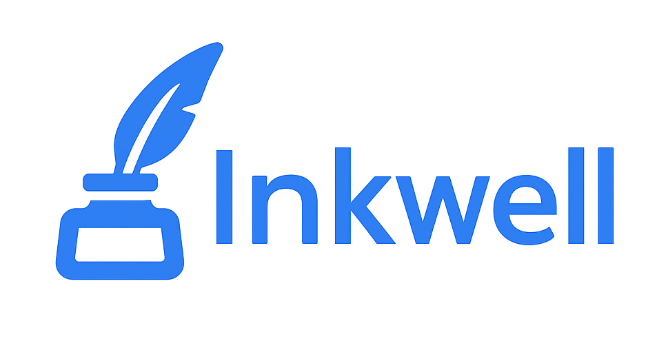

# Description

**Inkwell** is an AI-powered web application built with Laravel that generates professional, personalized cover letters in seconds. Simply upload your resume (PDF), paste a job description, and choose your preferred writing style. Inkwell uses Google Gemini AI to craft a tailored cover letter, which you can edit in the browser and download as a PDF. The app features a modern, user-friendly interface with drag-and-drop upload, privacy-first design, and no data retention.

# Inkwell: AI-Powered Cover Letter Generator

Welcome to **Inkwell**, a modern Laravel web application that helps you generate professional cover letters instantly and for free! Upload your resume, paste a job description, and let AI craft a tailored cover letter you can download as a PDF.

<p align="center">
  
</p>

---

## ✨ Features

- **AI-Generated Cover Letters:** Upload your resume (PDF), provide a job description, and get a custom cover letter in seconds.
- **Multiple Writing Styles:** Choose from Casual, Professional, or Excited tones.
- **Edit & Download:** Edit the generated letter in your browser and download it as a PDF.
- **User-Friendly UI:** Clean, responsive design with drag-and-drop file upload.
- **Privacy First:** Your data is never stored.

---

## 🚀 Quick Start

### 1. Clone the Repository
```bash
git clone https://github.com/yourusername/cover-letter-generator.git
cd cover-letter-generator
```

### 2. Install Dependencies
```bash
composer install
npm install
```

### 3. Environment Setup
Copy the example environment file and set your keys:
```bash
cp .env.example .env
php artisan key:generate
```

- Configure your [Google Gemini API](https://ai.google.dev/) key in `.env` if using Gemini for AI.

### 4. Build Frontend Assets
```bash
npm run build
```

### 5. Run the Application
```bash
php artisan serve
```
Visit [http://localhost:8000](http://localhost:8000) in your browser.

---

## 📝 Usage
1. **Upload Resume:** Drag and drop your PDF resume or browse to select it.
2. **Paste Job Description:** Copy-paste the job description or requirements.
3. **Choose Writing Style:** Select your preferred tone.
4. **(Optional) Add Info:** Add any extra instructions.
5. **Generate Letter:** Click to generate your cover letter.
6. **Edit & Download:** Make edits if needed, then download as PDF.

---

## 🛠️ Tech Stack
- **Backend:** Laravel 10+
- **Frontend:** Blade, Tailwind CSS, Vanilla JS
- **PDF Generation:** [barryvdh/laravel-dompdf](https://github.com/barryvdh/laravel-dompdf)
- **AI Integration:** Google Gemini API (via [google-gemini-php](https://github.com/GoogleCloudPlatform/google-gemini-php))

---

## 📂 Project Structure
```
app/Http/Controllers/      # Main logic (ResumeController)
resources/views/           # Blade templates
resources/js/              # Frontend JS (app.js)
public/                    # Public assets (logo, icons)
routes/web.php             # Web routes
```

---

## 🤖 AI Model
This project uses Google Gemini for generating cover letters. You must provide your own API key in the `.env` file.

---

## 🧪 Testing
Run tests with:
```bash
php artisan test
```

---

## 💡 Contributing
Pull requests are welcome! For major changes, please open an issue first to discuss what you would like to change.

---

## 📬 Contact
For questions or feedback, open an issue or contact [alecxanderandaya6@gmail.com](alecxanderandaya6@gmail.com).
